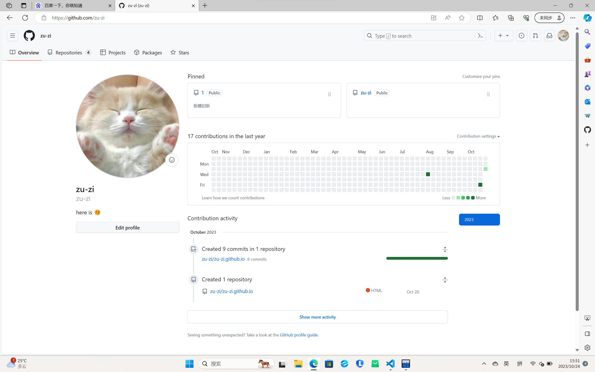
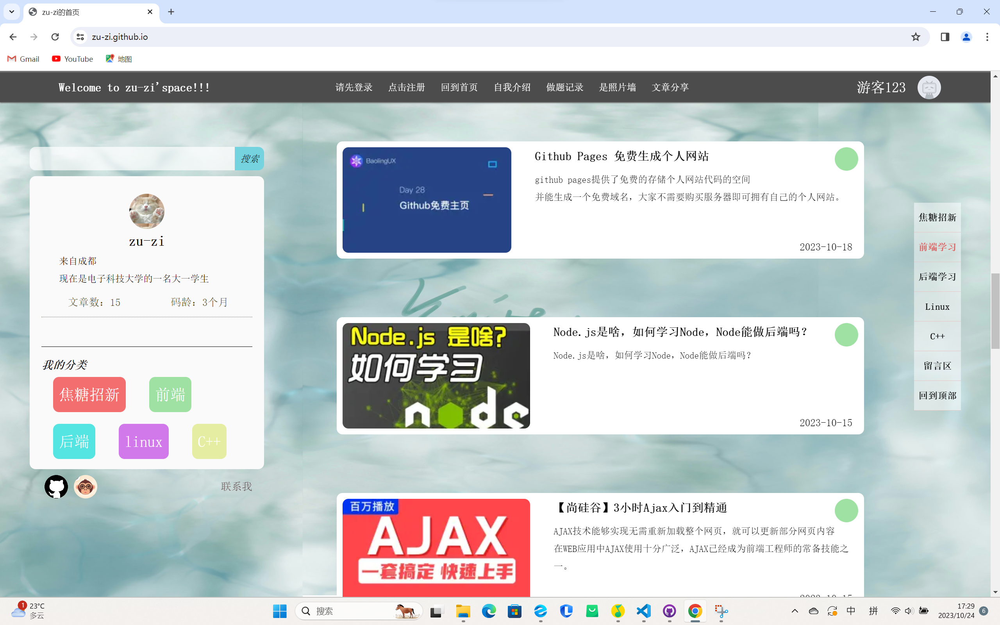

# *1.Github*
- 通过查单词和搜索才弄明白要怎样建一个*新仓库*，*上传文件*，*README.md的格式及作用*，以及如何*有效管理自己的分支*
- Github 真的好好逛，学到了很多，开源真的好酷
- 还pull了一些自己感兴趣的代码来运行
- 好喜欢Git管理代码和回溯的能力，脑子感觉都被项目和分支理清了，就是官网有时候上不去啦
- Git pages 搭建静态博客好棒好棒，很方便简单
  ***
- 
- 这是我的[首页](https://github.com/zu-zi)

***
- 
- 
- 这是我前端题写的[博客](https://zu-zi.github.io/task1/P1%20register.html),并将它部署到了Github Pages上
  
- 这是我的前端[部署仓库](https://github.com/zu-zi/zu-zi.github.io)
***
- 这是我本次[提交所有代码的仓库](https://github.com/zu-zi/JoTang)
